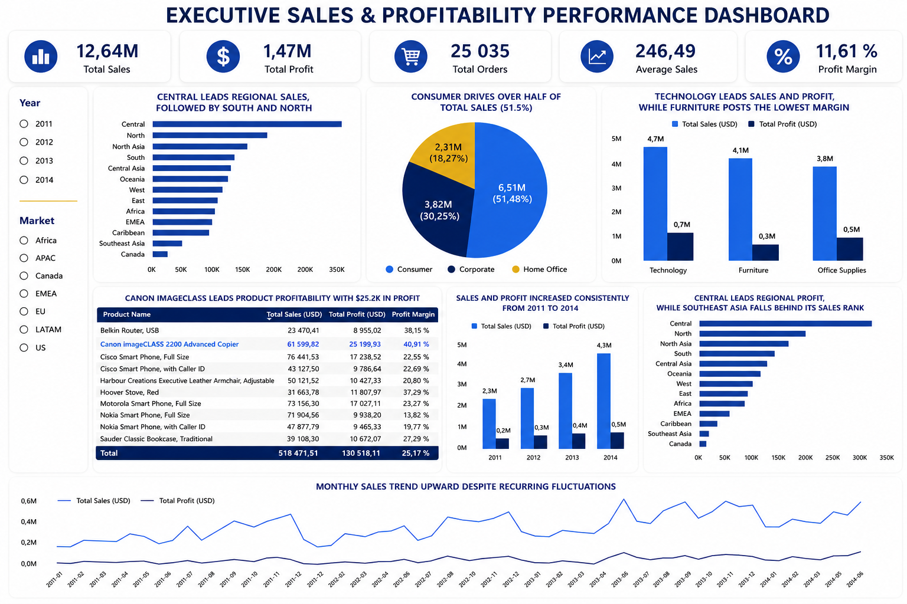

# Global Superstore — Business Intelligence & Sales Performance Analysis

## Project Overview

This Business Intelligence project analyzes the **Global Superstore dataset** to help management monitor sales performance, profitability, customer segments, product performance, regional performance, and business trends.

The project was developed as part of the **AnalystLab Africa Data Analytics Internship — Week 2: Business Intelligence & Interactive Dashboard Development**.

The objective was not simply to visualize sales data, but to transform business data into **actionable insights, management priorities, and monitoring KPIs** using Microsoft Power BI.

---

## Business Problem

Management needs a consolidated view of business performance to understand:

- How the company is performing overall;
- Which regions generate the highest sales and profit;
- Which customer segments contribute the most revenue;
- Which product categories perform best;
- Which products are the most profitable;
- How sales and profitability evolve over time;
- Where business risks and opportunities require management attention.

### Business Objective

> **How can management use sales data to monitor overall business performance, identify the regions, customer segments, product categories, and products driving sales and profitability, detect performance trends, and identify risks and opportunities that can support better business decisions?**

---

## Why Global Superstore?

The assignment provided a choice between the Superstore Sales Dataset and the Global Superstore Dataset.

**Global Superstore was selected because its broader business and geographical scope provides stronger analytical coverage of the business questions**, particularly for comparing sales and profitability across regions, customer segments, product categories, products, and time.

This makes the dataset particularly suitable for an executive Business Intelligence dashboard requiring multiple management perspectives.

---

## Dataset

**Dataset:** Global Superstore  
**Analysis Period:** 2011–2014

Main analytical dimensions include:

- Date
- Market
- Region
- Customer Segment
- Category
- Sub-Category
- Product
- Sales
- Profit
- Discount
- Shipping Cost

---

## Data Preparation

Data preparation and quality checks were performed in **Power Query** before dashboard development.

The process included:

- Reviewing dataset structure and data types;
- Checking missing values;
- Removing duplicate records where necessary;
- Correcting inappropriate data types;
- Validating Order Date and Ship Date consistency;
- Reviewing quantitative variables for unusual or impossible values;
- Reviewing categorical dimensions;
- Validating Market–Region relationships;
- Investigating Product ID–Product Name inconsistencies;
- Documenting geography-related inconsistencies;
- Creating analytical fields required for time and profitability analysis.

The objective was to ensure that the dashboard was built on a sufficiently reliable analytical foundation before KPI calculation and visualization.

---

## Data Model & KPI Framework

A lightweight analytical model was implemented in Power BI, including a dedicated Date dimension and product-level analytical structure.

Core measures were created using **DAX**.

### Executive KPIs

| KPI | Result |
|---|---:|
| Total Sales | **$12.64M** |
| Total Profit | **$1.47M** |
| Total Orders | **25,035** |
| Average Sales | **$246.49** |
| Profit Margin | **11.61%** |

Additional measures were used to evaluate profitability, customer activity, discount behavior, shipping costs, and performance over time.

---

## Executive Dashboard

The dashboard combines executive KPIs with regional, customer, category, product, and time-based analysis.

Interactive **Year** and **Market** slicers allow users to explore performance dynamically.

The Power BI report also includes a dedicated **Executive Summary page** translating analytical findings into business risks, opportunities, management priorities, and monitoring KPIs.

---

## Key Business Insights

### 1. Sustained Growth

Sales increased from approximately **$2.26M in 2011 to $4.30M in 2014**, while profit increased from approximately **$248.9K to $504.2K**.

The company therefore experienced sustained growth in both revenue and absolute profit over the analysis period.

### 2. Consumer Segment Drives Revenue

The **Consumer segment contributes approximately 51.5% of total sales**, making it the company's largest customer segment by revenue.

This concentration makes Consumer performance strategically important to overall business results.

### 3. Technology Leads Category Performance

**Technology generates approximately $4.74M in sales and $663.8K in profit**, making it the strongest category in both sales and absolute profit.

### 4. Furniture Shows a Profitability Gap

Furniture generates approximately **$4.11M in sales**, but its profit margin is only **6.94%**, compared with approximately **14% for Technology and Office Supplies**.

High sales volume therefore does not automatically translate into strong profitability.

### 5. Regional Sales and Profitability Do Not Always Align

Central leads regional sales and profit, while some regions show a weaker conversion of sales into profit.

**Southeast Asia is particularly important to investigate because its profitability ranking falls behind its relative sales performance.**

---

## Business Risks

### 1. Margin Pressure

Strong sales growth may hide profitability weaknesses if management focuses primarily on revenue rather than margin quality.

### 2. Furniture Profitability

Furniture generates substantial sales but significantly weaker margins than the other major categories.

### 3. Regional Profit Conversion

Regions with relatively strong sales may still produce weaker profitability, creating a risk of overestimating performance when using sales alone.

---

## Business Opportunities

### 1. Scale Technology Performance

Technology combines strong sales and strong profit generation, making it an important source of profitable growth patterns.

### 2. Leverage High-Value Products

Highly profitable products provide opportunities to identify product characteristics and commercial patterns that can be replicated.

### 3. Deepen Consumer Value

With more than half of total sales coming from the Consumer segment, improving customer value within this segment could materially influence overall performance.

---

## Management Recommendations

### 1. Protect Margin, Not Revenue Alone

Management should evaluate performance using **Sales, Profit, and Profit Margin together** rather than relying primarily on sales growth.

**KPIs to monitor:** Profit Margin %, Total Profit, Sales Growth.

### 2. Diagnose and Improve Furniture Profitability

Investigate the drivers of Furniture's lower margin, including discounting, product mix, shipping costs, and regional performance.

**KPIs to monitor:** Furniture Profit Margin, Discount Rate, Shipping Cost, Profit by Sub-Category.

### 3. Manage Regions for Profitability

Regional performance reviews should combine sales volume with profit and margin to identify regions where commercial activity is not converting efficiently into economic value.

**KPIs to monitor:** Regional Sales, Regional Profit, Regional Profit Margin.

### 4. Scale Profitable Patterns

Identify the characteristics of high-performing categories and products and evaluate where these patterns can be replicated.

**KPIs to monitor:** Profit by Category, Profit by Product, Product Profit Margin.

### 5. Deepen Consumer Value

Protect and develop the Consumer revenue base while monitoring whether its scale translates into sustainable profitability.

**KPIs to monitor:** Consumer Sales, Consumer Profit, Consumer Profit Margin.

---

## Decision Framework

The analytical approach used throughout the project follows a decision-oriented logic:

**Measure → Compare → Diagnose → Prioritize → Act**

The objective is to move beyond reporting and use Business Intelligence to identify:

- **where performance is created;**
- **where profitability is being weakened;**
- **where management attention should be prioritized;**
- **which KPIs should be monitored after action is taken.**

---

## Tools & Skills

### Tools

- **Microsoft Power BI**
- **Power Query**
- **DAX**
- Data Modeling
- Data Visualization

### Analytical Skills

- Business Intelligence
- KPI Design
- Sales Performance Analysis
- Profitability Analysis
- Customer Segmentation
- Regional Performance Analysis
- Product Performance Analysis
- Business Risk Identification
- Opportunity Identification
- Executive Reporting
- Data-Driven Recommendations

---

## Project Deliverables

| Deliverable | Access |
|---|---|
| Executive Dashboard | [View Dashboard Export](dashboard/WK2_Global_Superstore_Executive_Dashboard_Nancy_Lee_YIMBERE_ALAPINI.pdf) |
| Power BI Project | Available in the `powerbi` folder |
| Business Intelligence Overview Report | Available in the `reports` folder |
| Executive Summary Report | Available in the `reports` folder |

---

## Key Takeaway

> **Strong sales do not automatically mean strong business performance. The quality of performance becomes clearer when Sales, Profit, and Profit Margin are analyzed together.**

This project reinforced a core principle of my analytical approach:

**A KPI tells us what happened.  
Segmentation helps reveal where it happened.  
Diagnosis helps us understand why it matters.  
And only then can analytics support a better decision.**

---

## Author

**Nancy Lee YIMBERE ALAPINI**  
Performance & Decision Intelligence Analyst

*Data Analytics Internship Project — AnalystLab Africa*
